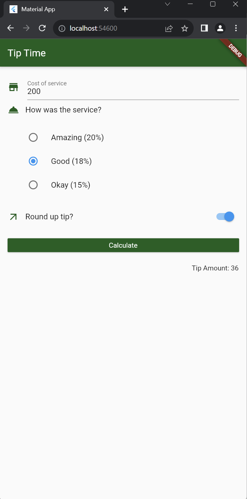

# App Tip Time

## Descripción

App Tip Time es una aplicación diseñada siguiendo los lineamientos de Material Design. Su objetivo principal es permitir al usuario calcular la propina de manera interactiva. La aplicación aprovecha eficientemente el espacio en pantalla y ofrece una experiencia de usuario intuitiva.

## Temas Abordados

- Uso de widgets Radio y Switch
- Interacción del usuario con controles de formulario
- Implementación de cambios de estado utilizando Provider
- Formateo de cadenas de texto
- Uso de Text Fields
- Radio group
- Utilización de la paleta de colores primarios

## Lo que me costó más trabajo

- Implementar el cambio de estado del Switch utilizando Provider.
- Lograr que los estilos de los widgets coincidieran exactamente con la pantalla principal de la aplicación.
- Inicialmente, intenté implementar la aplicación usando un enfoque Stateful y luego tuve que migrarla a Provider.

## Lo que aprendí

Durante el desarrollo de App Tip Time, aprendí:

- El uso efectivo del widget Switch para capturar la entrada del usuario.
- Cómo trabajar con Radio Buttons para obtener selecciones del usuario.
- La implementación de Provider para gestionar el estado de la aplicación.

## Capturas de Pantalla

A continuación, se presentan algunas capturas de pantalla de la aplicación:

# tip_time

A new Flutter project.

## Getting Started

This project is a starting point for a Flutter application.

A few resources to get you started if this is your first Flutter project:

- [Lab: Write your first Flutter app](https://docs.flutter.dev/get-started/codelab)
- [Cookbook: Useful Flutter samples](https://docs.flutter.dev/cookbook)

For help getting started with Flutter development, view the
[online documentation](https://docs.flutter.dev/), which offers tutorials,
samples, guidance on mobile development, and a full API reference.

<!-- Entrega -->
Descripción

Se requiere hacer una aplicación con diseño basado en lineamientos de material design, la cual aproveche de manera óptima el espacio en pantalla, además de mostrar al usuario una interfaz con la cual pueda interactuar y navegar dentro de la aplicación.

App – TipTime
Listado de temas plasmados
Interfaz de Usuario (UI): El diseño y la disposición de la interfaz de usuario son aspectos importantes. Esto incluye el uso de botones, cuadros de texto, casillas de verificación, barras de navegación y el estilo general de la aplicación.

Proveedor de Datos (Provider): Se utiliza el patrón de proveedor para administrar y compartir datos en toda la aplicación. Esto incluye el uso de ChangeNotifierProvider para administrar los datos de forraje.

Creación de un proveedor de datos llamado HomeProvider que extiende ChangeNotifier.

Gestión del estado de la aplicación, incluyendo el valor seleccionado del botón de radio, el valor del interruptor, y el cálculo de la propina.

Uso de un controlador de texto (TextEditingController) para recopilar el costo del servicio.

Proporciona métodos para cambiar el valor del botón de radio, el interruptor y calcular la propina.

Mantenimiento del estado de la propina y la configuración a través de notifyListeners().

Lo que me costó más trabajo
	La aplicación correcta de providers, me costó bastante tiempo entender que el change notifier provider tenía que encapsular todo el árbol de widgets y esto encapsulación llamarla a cada archivo correspondiente, también las funciones que provider posee para hacer todo lo debido para poder hacer las llamadas entradas de texto por ejemplo, después de mucho experimentar y con muchas ayudas de visual studio puede notar una estructura que era muy repetitiva y literal al contexto que estaba buscando hacer, todo esto me costó una gran cantidad de tiempo.

Lo que aprendí
El uso correcto de providers.
El uso extenso de Navigators.
Llamadas entre ventanas.
Funciones desde providers.
Uso de variables desde providers.
Alteración de datos guardados.
Estructuras complejas de interfaz.

Link video
https://www.youtube.com/shorts/IPkXWiPFaq0

